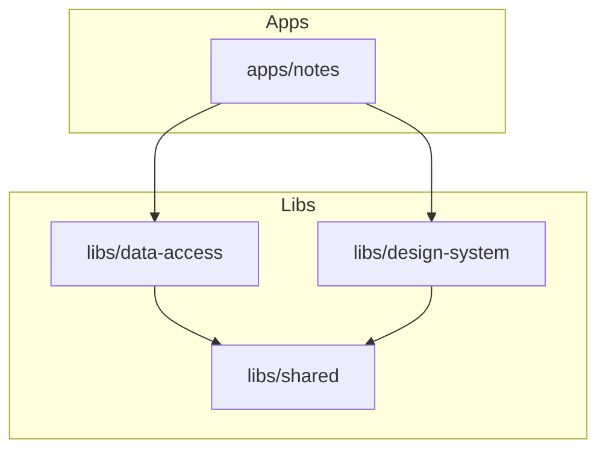

# Knowtis Workspace


**Knowtis** is a modern, collaborative workspace platform built as a monorepo. It features real-time note-taking capabilities, a robust design system, and a scalable architecture managed by [Nx](https://nx.dev).

## 🚀 Quick Start

**Prerequisites:** Node.js >= 18, pnpm >= 8.

1. **Install dependencies:**

   ```bash
   pnpm install
   ```

2. **Start the main application:**

   ```bash
   nx serve notes
   ```

   The app will be available at `http://localhost:5173`.

3. **Run all tests:**

   ```bash
   nx run-many -t test
   ```

## 📂 Repository Structure

This repository is organized into **Apps** (deployable units) and **Libs** (shared code).

### Applications (`/apps`)

- **[Notes App](./apps/notes/README.md)** (`apps/notes`):
  The primary collaborative note-taking application. Built with React 19, Vite, and Yjs for real-time sync.

### Libraries (`/libs`)

- **[Data Access](./libs/data-access)**: Domain logic, state management (Zustand), and API clients.
  - `notes`: Business logic for note manipulation.
- **[Design System](./libs/design-system)**: Reusable UI components, design tokens, and global styles.
- **[Shared](./libs/shared)**: Generic utilities and hooks used across the workspace.
  - `hooks`: Reusable React hooks.
  - `util`: Pure utility functions.

## 🛠️ Architecture

The project follows a **unidirectional dependency flow** to ensure maintainability and scalability.



For a deep dive into the architectural decisions, see [**ARCHITECTURE.md**](./docs/ARCHITECTURE.md).

## ⚡ Tooling & Commands

We use **Nx** to manage tasks, caching, and dependency visualization.

| Task      | Command              | Description                           |
| :-------- | :------------------- | :------------------------------------ |
| **Serve** | `nx serve <project>` | Start a dev server for a specific app |
| **Build** | `nx build <project>` | Build a project for production        |
| **Test**  | `nx test <project>`  | Run unit tests                        |
| **Lint**  | `nx lint <project>`  | Lint code                             |
| **Graph** | `nx graph`           | Visualize the dependency graph        |

## 📄 Documentation

- [**Workspace Architecture**](./docs/ARCHITECTURE.md): Detailed explanation of the monorepo structure.
- [**Notes App Guide**](./apps/notes/README.md): Specifics about the Notes app features and testing.
